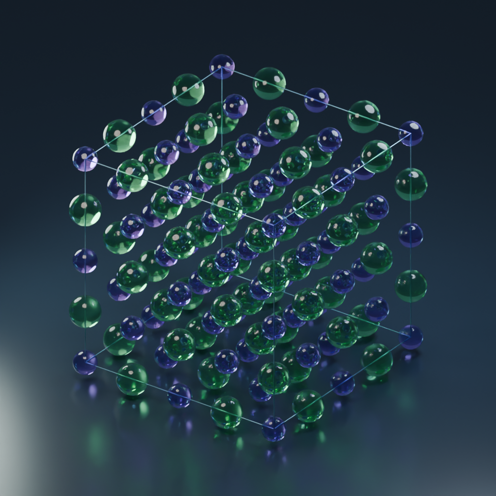
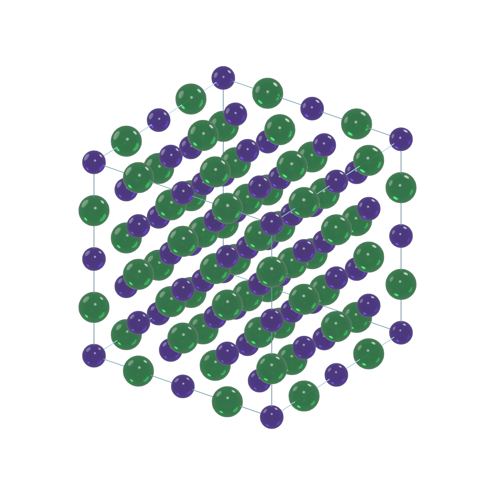

# Crystal in Blender

空間群・ワイコフ位置から結晶を生成する Blender アドオンです。原子は元素ごとに色分けしたガラス調マテリアルで表示します。Blender 4.2 以降を対象とし、Blender 5.1 で動作確認しています。追加の Python パッケージやネット接続は不要です。



## すぐに使う

1. `dist/crystal_builder-1.2.1.zip` を Blender の **Edit → Preferences → Add-ons → 右上メニュー → Install from Disk** からインストールし、有効にします。旧版を使用中の場合は更新後に Blender を再起動してください。
2. 3D ビューで **N** キーを押し、右側の **Crystal** タブを開きます。
3. Example で **NaCl** を選んで **Load**、続いて **Generate / Update Crystal** を押します。
4. Material Preview または Cycles の Rendered 表示でガラス材質を確認します。Solid 表示では透過は表示されません。

完成済みの `output/nacl_glass.blend` も開けます。NaCl の 2×2×2 スーパーセル、カメラ、照明、床を保存してあり、**F12** でレンダリングできます。アドオン未導入でも形状と材質は表示でき、アドオンを有効にしてから開けば入力値を編集して再生成できます。

## 任意の結晶を作る

- **Space group (ITA)**：1～230 の国際表番号を指定します。
- **Setting**：軸設定・原点設定を選択します。`#523` などはデータベース内の設定番号です。VESTA 等の資料と同じ設定を選んでください。空間群変更時はその群の最初の設定を選択します。
- **Unit cell**：格子定数 a, b, c（Å）と α, β, γ（度）を入力します。モデルでは 1 Blender unit を 1 Å に対応させます。空間群に適合しない格子はエラーになります。
- **Atomic sites**：`+` で元素サイトを追加し、元素記号と `4a` / `a` などのワイコフ記号を指定します。大文字 `A` と小文字 `a` は区別します。
- **x / y / z**：選択した位置の式に現れる自由パラメータだけを入力します。`1/3` 等の分数も使用できます。例：式が `(x,x,0)` なら x だけを設定します。固定座標は自動設定されます。
- **Repeat**：a, b, c 各方向の繰り返し数を設定します。
- **Generate / Update**：検証後に前回生成した専用コレクションを置き換えます。手作業での編集は再生成で失われるため、残したい場合は別コレクションへ移してください。Undo に対応します。

一覧には使用できるワイコフ記号が表示されます。特殊座標への縮退、多重度の誤指定、サイトの重複はエラーになります。格子パラメータは設定変更時に自動変換しません。

## ガラスと表示

初期値は **Transmission = 1.0 / Roughness = 0.12 / IOR = 1.45**。元素ごとに球メッシュを共有します。[Blender の Principled BSDF](https://docs.blender.org/manual/en/latest/render/shader_nodes/shader/principled.html) の透過を使用しています。

**Show atoms on outer faces** は外側境界にも原子を表示します。NaCl は単位胞内の原子数が8ですが、境界を含む1セルの表示は27球になります。ステータスで単位胞原子数と表示数を区別しています。スーパーセル枠は全体の外周12辺です。

**Distance bonds** は指定距離以下の表示原子間に棒を描く任意機能です。化学結合の自動判定ではありません。原子半径と色は可視化用で、定量的なイオン半径や光学定数ではありません。

## 白背景の論文用レンダリング（v1.1）

### 模様のないガラス表示（v1.2）

v1.2.1 では白背景でも色が薄くならないよう、ガラスと直進透過の両方を濃い元素色に調整しました。紫は深い紫、緑は深いエメラルド色になります。既存シーンには **Apply Glass Visibility** で反映できます。繰り返し適用しても色はさらに暗くなりません。Clean glass を解除すると元の色に戻ります。

**04 Display & glass → Clean glass (no repeated atom images)** は初期状態で有効です。斑点状に見えていた他の原子の反射像・屈折像と相互の影を除き、ガラスの光沢・色・透過シェーダーを維持します。既存の結晶には **Apply Glass Visibility** で適用してから、**Cycles** で再レンダリングしてください。新規生成と白背景シーン作成にも自動適用されます。

これは論文図向けの見た目を優先した設定です。ガラス成分内の反射・屈折像は非表示にし、35%の直進透過成分で背後を歪めずに透かします。物理的に厳密な透明体の表現とは異なりますが、照明の滑らかなハイライトと透明感を残せます。背後にある原子の輪郭そのものは薄く透けます。元の相互反射・屈折を使う場合はチェックを外して同じボタンを押します。不透明表示では通常の可視性に戻します。Cycles の [Ray Visibility](https://docs.blender.org/manual/en/4.2/render/cycles/object_settings/object_data.html) を利用しているため、Material Preview / Eevee では同じ効果にはなりません。

### 白背景シーンの作成

1. 結晶を **Generate / Update Crystal** で生成します。
2. Crystal パネルの **05 Publication / White background** を開きます。
3. Width / Height（初期値2400×2400 px）、Samples（128）、Margin per side（12%）を設定します。
4. **Create White Paper Scene** を押すと、専用の新しいシーンに切り替わります。
5. **F12** でレンダリングし、画像ウィンドウの **Image → Save As** からPNGとして保存します。



完成例は `output/nacl_paper_white.blend`（1800×1800 px / 64 samples）です。白背景、床なし、正投影カメラ、結晶全体の自動フレーミング、3灯の白色照明を設定します。背景が灰色にならないよう Standard 色変換とカメラ専用の白い World を使用します。元のシーンの背景・床・カメラは変更せず、結晶の形状と材質を独立したコピーとして保存します。ボタンを押すたびに新しいシーンを作成します。元のシーンへは Blender 上部のシーン選択から戻れます。

ガラス調を維持するのが初期設定です。**Opaque atoms for readability** を有効にすると、新しいシーンだけ不透明な原子表示にできます。原子の識別を優先する図に使用してください。入力値を編集した場合は、先に結晶を再生成してください。コピー後の元シーンの変更は論文用シーンに自動反映されません。論文用シーンで結晶のサイズを変えた場合は、再度ボタンを押すとカメラを合わせた新しいシーンを作れます。

画像サイズは投稿先の規定に合わせて設定してください。例えば横幅80 mm・300 dpi相当なら約945 pxが必要です（px = mm ÷ 25.4 × dpi）。この機能が設定するのはピクセル数で、PNGのDPIメタデータは設定しません。

参考：[Blender のカメラ](https://docs.blender.org/manual/en/latest/render/cameras.html)、[色管理](https://docs.blender.org/manual/en/latest/render/color_management.html)。

## サンプルと JSON

NaCl、ダイヤモンド、BCC 鉄、ルチル TiO₂ を同梱しています。**Import JSON / Export JSON** で結晶入力を保存・再利用できます。材質・照明は `.blend` に保存し、JSON は結晶構造の入力用です。

```json
{
  "name": "NaCl",
  "space_group": 225,
  "setting": 523,
  "cell": [5.64, 5.64, 5.64, 90, 90, 90],
  "repeats": [1, 1, 1],
  "boundary": true,
  "sites": [
    {"element": "Na", "wyckoff": "4a"},
    {"element": "Cl", "wyckoff": "4b"}
  ]
}
```

`setting` は省略すると最初の設定を使用します。自由座標は `"xyz": [0.305, 0, 0]` のように指定します。

## 開発と検証

```powershell
python -m unittest discover -s tests -v
python scripts/build_addon.py
& 'C:\Program Files\Blender Foundation\Blender 5.1\blender.exe' --background --factory-startup --python-exit-code 1 --python scripts/test_publication.py
& 'C:\Program Files\Blender Foundation\Blender 5.1\blender.exe' --background --factory-startup --python-exit-code 1 --python scripts/create_paper_demo.py
& 'C:\Program Files\Blender Foundation\Blender 5.1\blender.exe' --background --factory-startup --python-exit-code 1 --python scripts/blender_smoke_test.py
& 'C:\Program Files\Blender Foundation\Blender 5.1\blender.exe' --background --factory-startup --python-exit-code 1 --python scripts/create_demo.py
```

`create_demo.py` は新規シーン専用です。必ず `--factory-startup` と組み合わせて実行してください。

`crystal_builder/core.py` は Blender 非依存の結晶計算、`addon.py` は入力画面、`scene.py` は形状・材質生成、`scripts/` はZIPとデモ生成、`tests/` は検証です。

同梱データの230空間群・530設定に対応し、全3,467位置の多重度を検証しています。データの出典・扱いと検証範囲は [DATA_NOTICE.md](DATA_NOTICE.md) を参照してください。現版は完全占有の原子球モデルです。CIF入出力、部分占有・混合占有、配位多面体、粉末回折、結晶外形の成長シミュレーションは含みません。表示原子数の保守的見積もりを30,000以下に制限しています。
